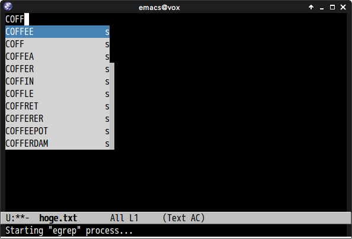

# ac-ispell.el

## Introduction

`ac-ispell.el` is ispell/aspell completion source for [auto-complete](https://github.com/auto-complete/auto-complete).
`ac-ispell` also supports **UPCASE** completion and **Capitalized** completion.


## Screenshot


### UPCASE Completion



### Capitalized completion


## Requirements

- Emacs 23 or higher
- [auto-complete](https://github.com/auto-complete/auto-complete)
- ispell/aspell


## How to use `ac-ispell` completion source

You can use `ac-ispell` source to push `ac-source-ispell` to `ac-sources`
in major/minor mode hook such as `mail-mode-hook` or `git-commit-mode-hook`
like configuration below.

```
(defun my/some-mode-hook ()
  (auto-complete-mode +1) ;; if auto-complete-mode is not enabled in some-mode
  (add-to-list 'ac-sources 'ac-source-ispell))

(add-hook 'some-mode-hook 'my/some-mode-hook)
```


## Commands

#### `ac-ispell-setup`

Declare ispell/aspell `auto-complete` source based on `ac-ispell-requires`.
This command must be called at the beginning.


## Customize Variables

#### `ac-ispell-requires`(Default `3`)

Required number of characters of this source completion.
You should change this value before calling `ac-ispell-setup`.

I recommend to use `custom-set-variable` for setting this value.


## Sample Configuration

```elisp
;; Completion words longer than 4 characters
(custom-set-variable
  '(ac-ispell-requires 4))

(eval-after-load "auto-complete"
  '(progn
      (ac-ispell-setup)))

(defun my/enable-ac-ispell ()
  (add-to-list 'ac-sources 'ac-source-ispell))

(add-hook 'git-commit-mode-hook 'my/enable-ac-ispell)
(add-hook 'mail-mode-hook 'my/enable-ac-ispell)
```
